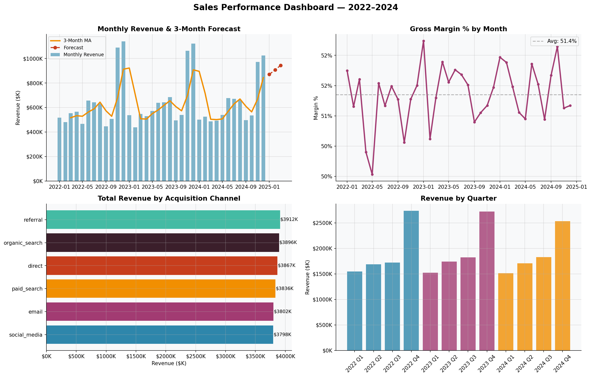
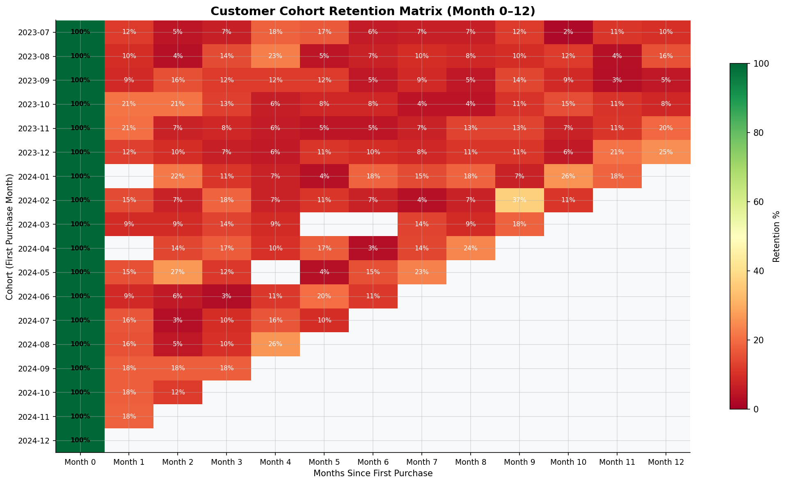
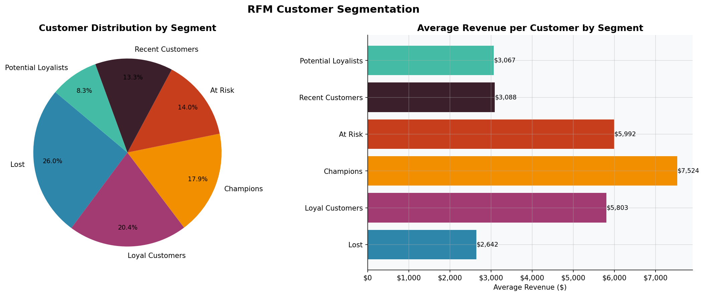
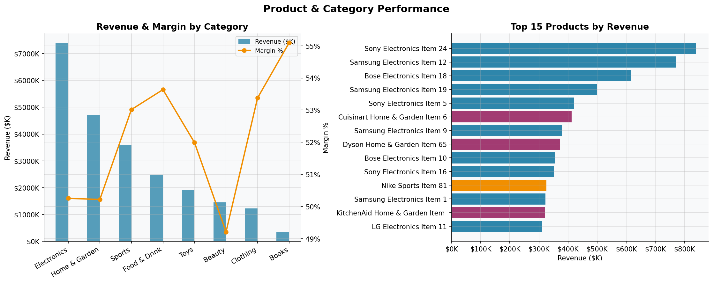

# 🛒 E-Commerce Sales Analytics Pipeline

A production-style end-to-end data analytics project covering the full analytics engineering lifecycle — from raw data ingestion through dbt-style SQL transformation models to Python-driven business intelligence and customer segmentation.

Built to demonstrate real-world analytics engineering and data analysis skills across SQL modeling, dbt, Python analytics, and BI dashboard design.

---

## 📊 Project Overview

| Dimension | Detail |
|---|---|
| **Dataset** | Synthetic e-commerce data — 20,000 orders, 5,000 customers, 200 products (2022–2024) |
| **Stack** | Python · SQL · dbt · Snowflake-compatible models · Power BI / Looker ready |
| **Techniques** | EDA · Cohort Retention · RFM Segmentation · Trend Forecasting · Product Analytics |
| **Outputs** | 4 publication-quality dashboards · dbt staging & mart models · KPI summary |

---

## 🗂️ Project Structure

```
ecommerce-analytics-pipeline/
│
├── data/
│   ├── generate_data.py        # Reproducible dataset generator
│   ├── orders.csv              # 20,000 orders with status, channel, discount
│   ├── customers.csv           # 5,000 customers with acquisition & demographic data
│   ├── products.csv            # 200 products across 8 categories
│   └── order_items.csv         # 38,000+ line items with revenue & margin
│
├── models/
│   ├── staging/
│   │   ├── stg_orders.sql          # Cleaned, typed orders with derived flags
│   │   ├── stg_customers.sql       # Normalised customer data + cohort month
│   │   └── stg_order_items.sql     # Line items with margin calculations
│   └── marts/
│       ├── fct_orders.sql              # Core fact table — orders + customer context
│       ├── dim_customers.sql           # Customer dimension + RFM scoring + LTV
│       ├── mart_monthly_sales.sql      # Monthly KPI mart with MoM growth & YTD
│       └── mart_product_performance.sql # Product performance + category ranking
│
├── analysis/
│   ├── analysis.py             # Full Python analysis pipeline
│   ├── 01_sales_dashboard.png  # Revenue trend, margin, channel, quarterly view
│   ├── 02_cohort_retention.png # Cohort retention heatmap (Month 0–12)
│   ├── 03_rfm_segmentation.png # RFM segment distribution + avg revenue
│   └── 04_product_performance.png # Category revenue/margin + top 15 products
│
├── dbt_project.yml             # dbt project configuration
└── README.md
```

---

## 🔧 dbt Models

### Staging Layer (`models/staging/`)
Lightweight views that clean, type-cast, and apply basic business rules to raw source tables. No business logic — just reliable, consistent inputs for the marts.

| Model | Description |
|---|---|
| `stg_orders` | Typed orders with `is_completed`, `is_returned` flags and date parts |
| `stg_customers` | Normalised customers with `cohort_month` for retention analysis |
| `stg_order_items` | Line items with `margin_pct` and `unit_margin` derived columns |

### Marts Layer (`models/marts/`)
Production-ready tables consumed by BI tools, dashboards, and downstream analysts.

| Model | Description | Key Features |
|---|---|---|
| `fct_orders` | Core orders fact table | Joins orders, customers, aggregated line items |
| `dim_customers` | Customer dimension with history | RFM scoring, LTV, repeat/loyalty flags |
| `mart_monthly_sales` | Monthly KPI aggregation | MoM growth %, YTD revenue, channel split |
| `mart_product_performance` | Product & category analytics | Revenue rank within category, performance tier |

---

## 📈 Analysis Outputs

### 1. Sales Performance Dashboard

- Monthly revenue with 3-month moving average and linear trend forecast
- Gross margin % trend with average benchmark
- Revenue breakdown by acquisition channel
- Quarterly revenue view across 3 years

### 2. Customer Cohort Retention Matrix

- Heatmap of retention % from Month 0 through Month 12 for 18 cohorts
- Identifies drop-off points, seasonal cohort effects, and loyalty trends

### 3. RFM Customer Segmentation

- Customers scored on Recency, Frequency, and Monetary value
- Six actionable segments: Champions, Loyal, Potential Loyalists, Recent, At Risk, Lost
- Avg revenue per segment to prioritise retention and re-engagement strategy

### 4. Product & Category Performance

- Revenue and gross margin by product category
- Top 15 products by revenue with category colour coding

---

## 📐 Key Business Metrics (2022–2024)

| Metric | Value |
|---|---|
| Total Revenue | $23.1M |
| Gross Margin | 51.4% |
| Total Orders | 18,686 |
| Unique Customers | 4,889 |
| Average Order Value | $1,237 |
| Repeat Customer Rate | 91.2% |
| Return Rate | 2.6% |

---

## 🚀 How to Run

### 1. Generate the dataset
```bash
cd data
python3 generate_data.py
```

### 2. Run the analysis pipeline
```bash
python3 analysis/analysis.py
```

### 3. Run dbt models (requires dbt + Snowflake/DuckDB profile)
```bash
dbt deps
dbt run --select staging
dbt run --select marts
dbt test
```

### Requirements
```
pandas>=1.5
numpy>=1.23
matplotlib>=3.6
dbt-core>=1.5 (for SQL models)
dbt-snowflake or dbt-duckdb (for model execution)
```

---

## 💡 Skills Demonstrated

- **Analytics Engineering**: dbt-style staging and mart model design with clear separation of concerns
- **SQL**: Window functions, CTEs, aggregations, RFM scoring, MoM growth calculations
- **Python**: pandas, numpy, matplotlib — EDA, cohort analysis, segmentation, forecasting
- **Data Modeling**: Fact/dimension design, Snowflake-compatible schemas, semantic layer thinking
- **Business Intelligence**: KPI framework design, dashboard storytelling, executive-ready outputs
- **Data Quality**: Null handling, type casting, deduplication, validation logic in staging models

---

## 👤 Author

**Emeka Ichoku** — Senior Data Analyst / Analytics Engineer  
[LinkedIn](https://www.linkedin.com/in/emeka-ichoku-11685277) · [Portfolio](https://github.com/your-github)

---

*Dataset is fully synthetic and generated for demonstration purposes.*
